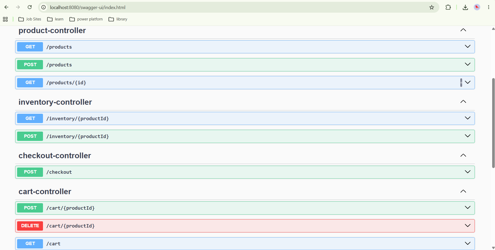
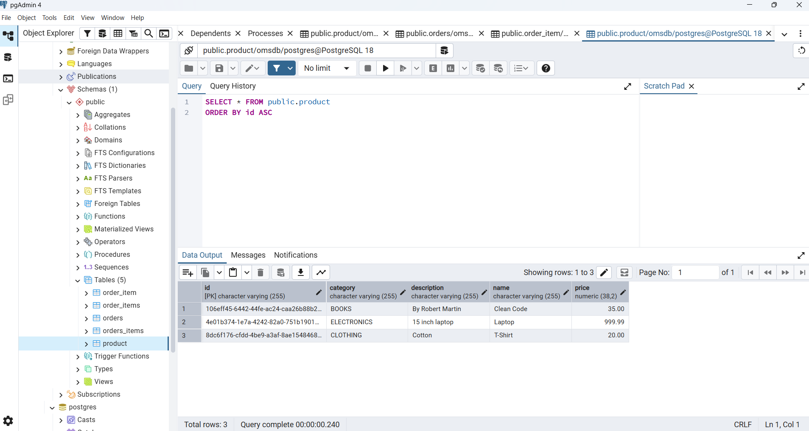
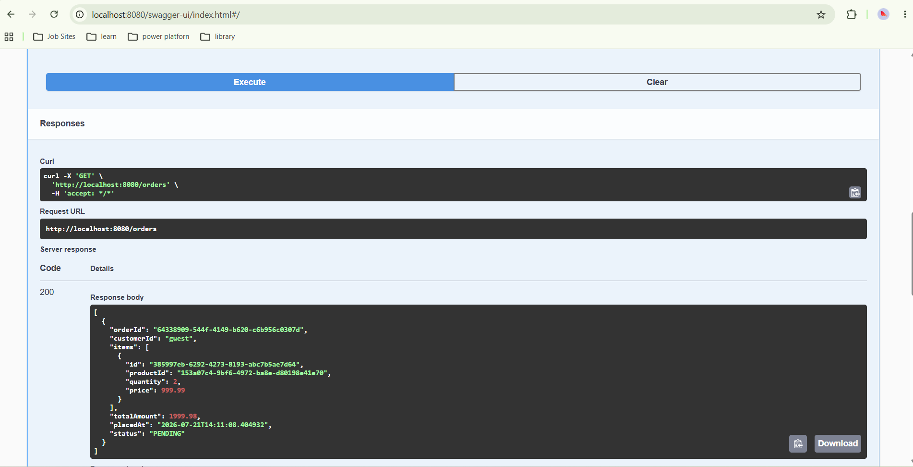
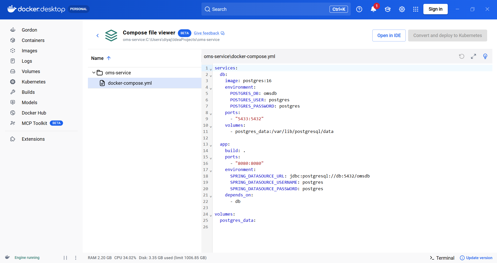

# Order Management System (OMS)

A Spring Boot backend application exposing REST APIs for product management, cart, checkout, and order processing. Built as a portfolio project to demonstrate Java backend engineering skills.

---
# Order Management System (OMS)

A Spring Boot backend application exposing REST APIs for product management, cart, checkout, and order processing. Built as a portfolio project to demonstrate Java backend engineering skills.

---

## Tech Stack

- **Java 17**, Spring Boot 3.2, Maven
- **PostgreSQL**, JPA/Hibernate, Spring Data JPA
- **Docker**, Docker Compose
- **REST APIs**, Swagger/OpenAPI
- **JUnit 5**, Mockito

---

## Features

- Product catalogue API (CRUD)
- Cart management with line total calculation
- Transactional checkout with stock validation
- Thread-safe inventory management (ConcurrentHashMap, AtomicInteger, ReentrantLock)
- Payment processing using Strategy design pattern
- Order reporting using Java Streams (filter, sort, aggregate)
- Global exception handling with @ControllerAdvice
- PostgreSQL persistence with JPA/Hibernate
- API documentation via Swagger UI

---

## Sprints

| Sprint | Focus | Status |
|--------|-------|--------|
| Sprint 1 | Domain model, OOP, Composition over Inheritance | ✅ Done |
| Sprint 2 | Collections — HashMap, TreeMap, Comparator, JUnit 5 | ✅ Done |
| Sprint 3 | Spring Boot REST APIs, @Transactional checkout | ✅ Done |
| Sprint 4 | Multithreading — ConcurrentHashMap, AtomicInteger, ReentrantLock | ✅ Done |
| Sprint 5 | Strategy pattern (payments), Java Streams (order reports) | ✅ Done |
| Sprint 6 | Global exception handling, Swagger/OpenAPI, InventoryController | ✅ Done |
| Sprint 7 | PostgreSQL, JPA/Hibernate, Spring Data repositories | ✅ Done |
| Sprint 8 | Docker + Docker Compose | ✅ Done |
| Sprint 9 | Microservices split | 🔄 Planned |
| Sprint 10 | Kafka event-driven architecture | 🔄 Planned |

---

## Running Locally

### Option 1 — Docker (recommended)

### Prerequisites
- Docker Desktop

```bash
git clone https://github.com/diyajimmys-png/oms-service.git
cd oms-service
docker compose up --build
```

Swagger UI available at: `http://localhost:8080/swagger-ui/index.html`

To stop:
```bash
docker compose down
```

### Option 2 — Run without Docker

### Prerequisites
- Java 17
- Maven
- PostgreSQL (create a database called `omsdb`)

Update `src/main/resources/application.properties` with your PostgreSQL credentials:

```properties
spring.datasource.url=jdbc:postgresql://localhost:5432/omsdb
spring.datasource.username=postgres
spring.datasource.password=postgres
```

Run from IntelliJ or:
```bash
mvn spring-boot:run
```

---

## Screenshots

**Swagger UI — API Endpoints**


**PostgreSQL — Product Table**


**Orders API Response**


**Docker Desktop — Containers Running**


---

## Architecture Decisions

- **UUID strings** for all IDs — safe for distributed systems, no coordination needed
- **BigDecimal** for all monetary values — no floating point rounding errors
- **Constructor injection** throughout — no @Autowired field injection
- **Thin controllers** — all business logic in service layer
- **DTO pattern** — `ProductRequest` separates API input from domain model
- **@Transactional at service layer** — not controller or repository

---

## API Endpoints

| Method | Endpoint | Description |
|--------|----------|-------------|
| GET | /products | Get all products |
| POST | /products | Add a product |
| GET | /products/{id} | Get product by ID |
| POST | /cart/add | Add item to cart |
| GET | /cart | View cart |
| POST | /checkout | Checkout and create order |
| GET | /orders | Get all orders |
| POST | /inventory/add | Add stock |
## Tech Stack

- **Java 17**, Spring Boot 3.2, Maven
- **PostgreSQL**, JPA/Hibernate, Spring Data JPA
- **REST APIs**, Swagger/OpenAPI
- **JUnit 5**, Mockito

---

## Features

- Product catalogue API (CRUD)
- Cart management with line total calculation
- Transactional checkout with stock validation
- Thread-safe inventory management (ConcurrentHashMap, AtomicInteger, ReentrantLock)
- Payment processing using Strategy design pattern
- Order reporting using Java Streams (filter, sort, aggregate)
- Global exception handling with @ControllerAdvice
- PostgreSQL persistence with JPA/Hibernate
- API documentation via Swagger UI

---

## Sprints

| Sprint | Focus | Status |
|--------|-------|--------|
| Sprint 1 | Domain model, OOP, Composition over Inheritance | ✅ Done |
| Sprint 2 | Collections — HashMap, TreeMap, Comparator, JUnit 5 | ✅ Done |
| Sprint 3 | Spring Boot REST APIs, @Transactional checkout | ✅ Done |
| Sprint 4 | Multithreading — ConcurrentHashMap, AtomicInteger, ReentrantLock | ✅ Done |
| Sprint 5 | Strategy pattern (payments), Java Streams (order reports) | ✅ Done |
| Sprint 6 | Global exception handling, Swagger/OpenAPI, InventoryController | ✅ Done |
| Sprint 7 | PostgreSQL, JPA/Hibernate, Spring Data repositories | ✅ Done |
| Sprint 8 | Docker + Docker Compose | 🔄 Planned |
| Sprint 9 | Microservices split | 🔄 Planned |
| Sprint 10 | Kafka event-driven architecture | 🔄 Planned |

---

## Running Locally

### Prerequisites
- Java 17
- Maven
- PostgreSQL (create a database called `omsdb`)

### Setup

```bash
git clone https://github.com/diyajimmys-png/oms-service.git
cd oms-service
```

Update `src/main/resources/application.properties` with your PostgreSQL credentials:

```properties
spring.datasource.url=jdbc:postgresql://localhost:5432/omsdb
spring.datasource.username=postgres
spring.datasource.password=postgres
```

Run the application:

```bash
mvn spring-boot:run
```

Swagger UI available at: `http://localhost:8080/swagger-ui/index.html`

---

## Screenshots

**Swagger UI — API Endpoints**


**PostgreSQL — Product Table**


## Architecture Decisions

- **UUID strings** for all IDs — safe for distributed systems, no coordination needed
- **BigDecimal** for all monetary values — no floating point rounding errors
- **Constructor injection** throughout — no @Autowired field injection
- **Thin controllers** — all business logic in service layer
- **DTO pattern** — `ProductRequest` separates API input from domain model
- **@Transactional at service layer** — not controller or repository

---

## API Endpoints

| Method | Endpoint | Description |
|--------|----------|-------------|
| GET | /products | Get all products |
| POST | /products | Add a product |
| GET | /products/{id} | Get product by ID |
| POST | /cart/add | Add item to cart |
| GET | /cart | View cart |
| POST | /checkout | Checkout and create order |
| GET | /orders | Get all orders |
| POST | /inventory/add | Add stock |
